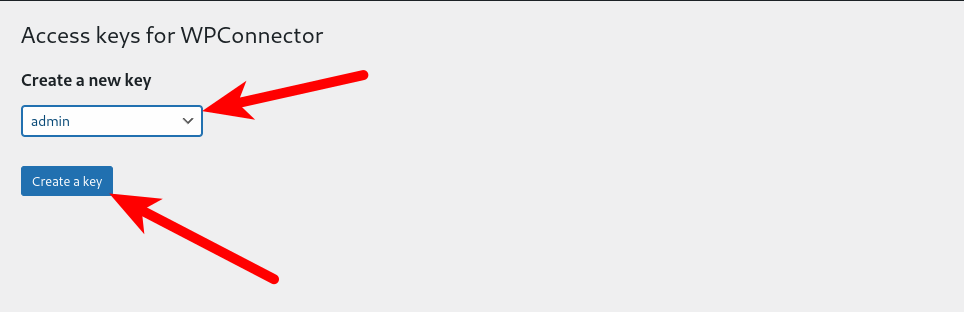
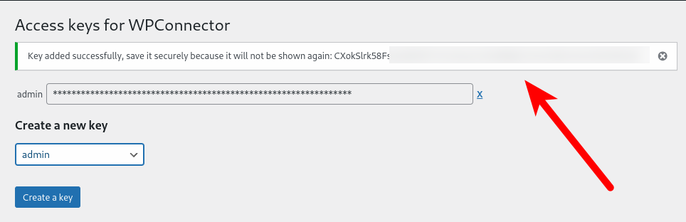

# WPAJaxConnector Plugin

⚠️ This plugin is currently in Alpha stage and therefore may contain bugs and errors. Use with caution.

## Description

A simple plugin that implements a HTTP API for WordPress based on wp-ajax. With it you can access various WordPress functions, such as uploading images or creating posts programmatically via HTTP API.

Unlike the original WP REST API, authorization is done via an API key, and the plugin's features are designed to modify posts, not just retrieve it. Here are the main features:

- Uploading images to the media library
- Replacing an existing image in the media library
- Deleting images from the media library
- Retrieving image information and links
- Creating a post
- Deleting a post
- Getting metadata, content, blocks, category and other information for a post
- Change image preview for a post
- Change metadata, title, content, blocks, category, etc. for the post

The plugin was originally created for my blog many years ago, so it may contain project-specific code or code written for older versions of PHP. However, most of the features described here should work.

## Installing & Authorization

In order to use the plugin you need to install it on your site. You can clone it from this github repository:

```bash
cd wp-content/plugins
git clone https://github.com/Seriyyy95/wpajaxconnector-plugin.git
```

Then open **Settings** -> **WPAjaxConnector Settings** and create an access key for your user:



The key is stored in the database in the `wp-usermeta` table as a hash, so it will be shown only once - after creation. Then you need to save it in the application where you are going to use it. 



If you have a multisite, then because the list of users for all multisite subsites is the same, key for all subsites will be the same.

After you have obtained the key, you can make requests to the API. The key must be passed in the `X-ACCESS-KEY` header and the action field must contain the name of the endpoint to be called. An example of a request that checks that the plugin works with curl:

```bash
curl -XGET -H "X-Access-Key: ******************************************" "https://example.com/wp-admin/admin-ajax.php?action=is_accessible"
```

And if the request is successful, you will receive a response in JSON format:

```json
{
  "success": true
}
```

Other available endpoints are described in the next section. The queries will only work if the user has permission to edit posts (`edit_posts`).

## Available Endpoints

### Upload Attachment

Action: add_attachments

Required parameters:
 - attachment_name - name of the attachment file with an extension. It will be used to create file in site filesystem
 - attachment_data - image file content encoded as base64

Optional parameters:
 - post_id - ID of the parent post, usually the ID of the article in which the image will be inserted

Example response:

```json
{
    "data": {
        "attachment_id": 456,
        "attachment_url": "https://example.com/wp-content/uploads/2024/01/example.jpg",
        "filesize": 1024000,
        "width": 1920,
        "height": 1080,
        "sizes": {
            "large": "https://example.com/wp-content/uploads/2024/01/example-large.jpg",
            "thumbnail": "https://example.com/wp-content/uploads/2024/01/example-thumbnail.jpg"
        }
    }
} 
```

Pay attention, that W3TC database cache should be disabled to make this working. Otherwise, uploaded image will be broken.

### Create Post

Action: add_post

Required parameters:
- post_title - title for a new post

Optional parameters:
- post_content - content for a new post

Example response:

```json 
{
    "data": {
        "post_id": 123,
        "url": "https://example.com/post-123",
        "title": "New Post"
    }
} 
```

The author of the post becomes the user whose access key was used to authorize the request.

### Delete Attachment

Action: delete_attachment

Required parameters:
- attachment_id - identifier of the attachment to be deleted

Example response:

```json
{
"success": true
}
```

### Delete Post

Action: delete_post

Required parameters:
- post_id - identifier of the post to be deleted

Example response:

```json
{
    "success": true
} 
```

### Get the Attachment 

Action: get_attachment

Required parameters:
- attachment_id - identifier of the image to get

Example response:

```json
{
    "data": {
        "attachment_id": 456,
        "attachment_url": "https://example.com/wp-content/uploads/2024/01/example.jpg",
        "filesize": 1024000,
        "width": 1920,
        "height": 1080,
        "sizes": {
            "large": "https://example.com/wp-content/uploads/2024/01/example-large.jpg",
            "thumbnail": "https://example.com/wp-content/uploads/2024/01/example-thumbnail.jpg"
        }
    }
} 
```

### Get Gutenberg Blocks for Post

Action: get_post_blocks

Required parameters:
- post_id - post identifier

Example response:

```json
{
    "data": {
        "post_id": 123,
        "blocks": [
            {
                "blockName": "core/paragraph",
                "attrs": {},
                "innerBlocks": [],
                "innerHTML": "<p>Example paragraph block</p>",
                "innerContent": ["<p>Example paragraph block</p>"]
            }
        ]
    }
} 
```

The method returns the blocks as an array, which can then be used to modify the contents of the blocks.

### Get Post Data

Action: get_post_data

Required parameters:
- post_id - post identifier

Example response:

```json
{
    "data": {
        "post_id": 123,
        "post_title": "Example Post",
        "post_content": "<p>This is the post content.</p>",
        "post_status": "publish",
        "post_parent": 0,
        "post_type": "post",
        "post_mime_type": null,
        "publish_date": "2024-01-01 12:00:00",
        "last_modified": "2024-01-01 12:00:00",
        "post_url": "https://example.com/post-123",
        "category": "Example Category",
        "tags": ["tag1", "tag2"],
        "author": "admin"
    }
} 
```

### Get the Value of the Meta Field

Action: get_post_meta

Required parameters:
- post_id - post identifier
- meta_key - name of the meta field to get

Example response:

```json
{
    "data": {
        "key": "example_meta_key",
        "value": "example_meta_value"
    }
} 
```

If such a meta field for the specified post was not specified, or contains an empty value, null will be returned.

### Get the Post Thumbnail

Action: get_post_thumbnail

Required parameters:
- post_id - post identifier

Example response:

```json
{
    "data": {
        "attachment_id": 456,
        "attachment_url": "https://example.com/wp-content/uploads/2024/01/example.jpg",
        "filesize": 1024000,
        "width": 1920,
        "height": 1080,
        "sizes": {
            "large": "https://example.com/wp-content/uploads/2024/01/example-large.jpg",
            "thumbnail": "https://example.com/wp-content/uploads/2024/01/example-thumbnail.jpg"
        }
    }
} 
```

### Check Accessibility

Action: is_accessible

No parameters needed

Example response:

```json
{
    "success": true
} 
```

### Get List of Attachments

Action: list_attachments

Optional parameters:

- sort - sorting attachments, by default `relevance`
- order - sorting order, by default `desc`
- count - number of images returned on page, by default 30
- page - page to be returned, default is 1
- text - search text
- post_id - parent post of the image
- start_date - return images with publication date greater than the specified date
- end_date - return images whose publication date is less than the specified date

Example response:

```json
{
    "attachments": [
        {
            "attachment_id": 456,
            "attachment_url": "https://example.com/wp-content/uploads/2024/01/example.jpg",
            "filesize": 1024000,
            "width": 1920,
            "height": 1080,
            "sizes": {
                "large": "https://example.com/wp-content/uploads/2024/01/example-large.jpg",
                "thumbnail": "https://example.com/wp-content/uploads/2024/01/example-thumbnail.jpg"
            }
        }
    ],
    "has_more": false
} 
```

### Get List of Posts

Action: list_attachments

Optional parameters:

- sort - sorting attachments, by default `relevance`
- order - sorting order, by default `desc`
- count - number of posts returned at a time, by default 30
- page - page to be returned, default is 1
- text - search text
- post_id - parent post
- start_date - return posts with a publication date greater than the specified one
- end_date - return posts whose publication date is less than the specified date

The date format for the last two parameters should be 2025-12-31 23:59:59

Example response:

```json
{
    "posts": [
        {
            "post_id": 123,
            "url": "https://example.com/post-123",
            "title": "Example Post"
        }
    ],
    "has_more": false
} 
```

### Change the Category

Action: set_post_category

Required parameters:
- post_id - post identifier
- category_id - category identifier

Example response:

```json 
{
    "data": {
        "post_id": 123
    }
} 
```

A post can only be in one category. If another category is already selected, it will be replaced.

### Change Gutenberg Blocks for the Post

Action: set_post_blocks

Required parameters:
- post_id - post identifier
- blocks - blocks as an array obtained from `get_post_blocks`

Example response:

```json
{
    "data": {
        "post_id": 123
    }
} 
```

### Change the Post Content

Action: set_post_content

Required parameters:
- post_id - post identifier
- post_content - post content as a string

Example response:

```json
{
    "data": {
        "post_id": 123
    }
} 
```

### Change the Meta Field Value for the Post

Action: set_post_meta

Required parameters:
- post_id - post identifier
- post_meta - an array where the key is the field name and the value is the value to be set for this field

Example response:

```json
{
    "data": {
        "post_id": 123
    }
} 
```

### Change the Parent Post

Action: set_post_parent

Required parameters:
- post_id - post identifier
- post_parent_id - identifier of new parent post

Example response:

```json
{
    "data": {
        "post_id": 123
    }
} 
```

### Change the Thumbnail of The Post

Action: set_post_thumbnail

Required parameters:
- post_id - post identifier
- attachment_id - identifier of the attachment that will be used as a thumbnail

Example response:

```json
{
  "data": {
    "post_id": 123
  }
} 
```

### Change the Title of the Post

Action: set_post_title

Required parameters:
- post_id - post identifier
- post_title - new post title

Example response:

```json
{
    "data": {
        "post_id": 123
    }
} 
```

### Replace the Existing Image

Action: update_attachment

Required parameters:
- attachment_id - identifier of the image to be replaced
- attachment_data - new image encoded in base64

Example response:

```json
{
    "data": {
        "attachment_id": 456,
        "attachment_url": "https://example.com/wp-content/uploads/2024/01/example.jpg",
        "filesize": 1024000,
        "width": 1920,
        "height": 1080,
        "sizes": {
            "large": "https://example.com/wp-content/uploads/2024/01/example-large.jpg",
            "thumbnail": "https://example.com/wp-content/uploads/2024/01/example-thumbnail.jpg"
        }
    }
} 
```


